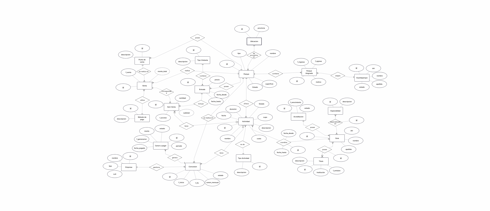

# Gestion De Parques Nacionales
## Grupo 6

## Introduccion

La Administración de Parques Nacionales requiere un sistema centralizado para gestionar la
operación de múltiples parques distribuidos en el territorio nacional.
Actualmente, gran parte de la información se maneja de forma descentralizada o manual, lo que
genera dificultades en el control de ingresos, gestión de servicios turísticos, supervisión de
concesiones y administración del personal.
El objetivo es diseñar un sistema que permita integrar toda esta información, mejorar la trazabilidad y
facilitar la toma de decisiones.

## DER

## Nomenclatura
TABLAS
Las tablas estarán escritas en singular, con la primer letra mayúscula. Usarán snake case si son compuestos
Ejemplo: Parque, Tipo_de_visitante.

COLUMNAS
Las columnas serán escritas en singular, en minúscula. En caso de ser nombre compuestos se usará snake case.
Ej: nombre, fecha_nacimiento

STORED PROCEDURES
Los stored procedures empezarán con 'sp' y serán escritos con snake case.
Ejemplo: sp_modificar_precios

FUNCIONES
Las funciones empezarán con 'fn' y usarán snake case
Ejemplo: fn_sumar_todos

TRIGGERS
Los triggers empezarán con 'tg' y usarán snake case
Ejemplo: tg_eliminar_campo

VIEWS
Los views empezarán con 'vw' y usarán snake case.
Ejemplo: vw_ventas_del_dia

CONSTRAINTS
Los constraints agregados explícitamente deberán tener un nombre descriptivo.
Ejemplo: fk_id_parque, check_mayor_de_edad

## Testing
SCRIPTS
Para poder ejecutar el proyecto, se deben ejecutar los siguientes scripts secuencialmente
1. `01_create_db_schemas.sql` - Crea la db y los esquemas.
2. `02_create_table.sql` - Crea las tablas
3. `03_sp_abm.sql` - Crea los SP de ABM
4. `04_create_roles_users.sql` - Crea los roles con sus respectivos login.
5. `05_sp.sql` - Crea los SP de logica de negocio.
6. `06_encriptacion.sql` - Encripta los datos sensibles.
7. `07_sp_abm_testing` - Testing de los SP ABM
8. `08_sp_test.sql` - Testing de los SP de logica de negocio
9. `09_creacion_views.sql` - Crea las vistas para los reportes
10. `10_poblacion.sql` - Genera registros para todas las tablas
11. `11_reportes.sql` - Genera reportes de estadisticas
12. `12_sp_importacion.sql` - Importa datasets
